# MS1---Gym-Website

# Fitness First Website (Members only Gym)

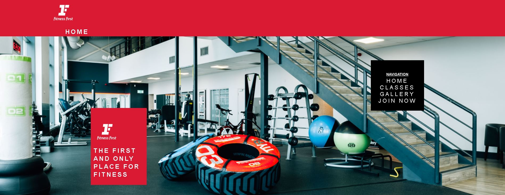

# Contents

## 1. Project Status
## 2. User Story
* 2.1 The business case (Project Goals)
* 2.2 Wireframes
* 2.3 Website Objectives:
* 2.4 Design Inspiration
## 3. Features
* 3.1 Existing Features
* 3.2 Features Left to Implement
* 3.3 Technologies Used
## 4. Testing
* 4.1 Informal
* 4.2 Formal
    - 4.2.1 External website testing
     + 4.2.1.1 Testing Results
    - 4.2.2 Functionality Testing
    - 4.2.3 Device Testing
    - 4.2.4 Spelling and Grammar
* 4.3 Bugs
## 5. Deployment
## 6. Credits
* 6.1 Content
* 6.2 Media
* 6.3 Acknowledgements
## 7. Lessons Learnt
* 7.1 Lessons
* 7.2 Future study points

# 1. Project Status
Deadline: 5th June 2021

The project is in the final checking stages. It should be considered ready for publication. Final checks against marking criteria required. 

# 2. User Story
## 2.1 The business case (Project Goals):
I was asked by my local gym Fitness First to create a wesbite for their gym. They have decided, that to increase the number of members using the gym, that they need a website with more information.
This website will be designed to give users more information about the gym known as "Fitness First". The website is aimed at users looking to join this gym and or get information on classes that they may find interesting.

Once the user has navigated the whole website they will have a better understanding of what the gym is, what it has to offer and be able to see some of its facilities. 

If they are then happy with the service the user will be able to join the gym using a form on a join page. 

The overall story would be as follows:
* Search for the gym (either via google or by entering the domain directly)
* Once loaded, the homepage will help the user understand the structure of the website, what pages it has and how to get more information
* The user can then choose between visiting the; Home page, Classes information page, gallery and Join page

## 2.2 Wireframes

### Sitemap

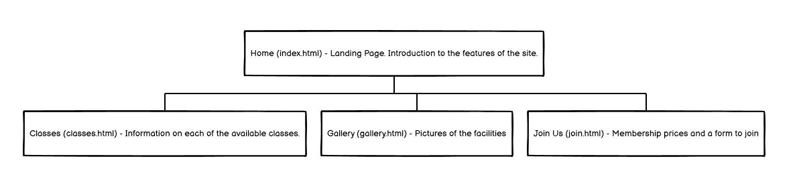

### Mobile Wireframes

General layout

The general layout looks primarily at the heading/navigation secion as well as the footer. The website wireframes were desinged with a mobile first approach.
The idea behind this was so that when the screen size expands the elements will shift accordingly left and right as if being stretched.

Header

From top down the header will have; an advert link at the very top directing the user to join,
a division with the logo with a text below indicating the current page, it will then have a hero image that has a floating text based navigation box to the right and a floating text based box to the left with some placeholder text that helps the user understand the page.

Footer 

The footer will include a disclaimer explaining the webpage is based on a project for the code institute course. It will then have links to official Fitness First sources.

Main Body of text

The main body of text will be expanded in further wireframes due to the need for specificity.

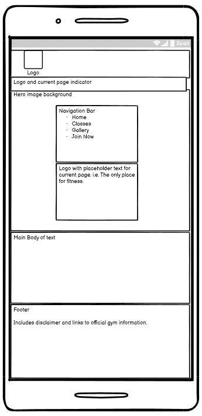

Home Page layout

The home page main body will consist of; generic gym picture with a floating text box that shows the 4 classes that the gym has available; spinning, yoga, boxing and aquafit.
The text will be a mixture of HTML elements, namely P and H1-H6. Below this will be a number of pictures of current gym users. At the very bottom will be a picture, created in canva
showing the current membership options and linking to the join us page.

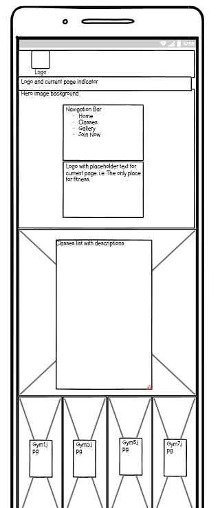

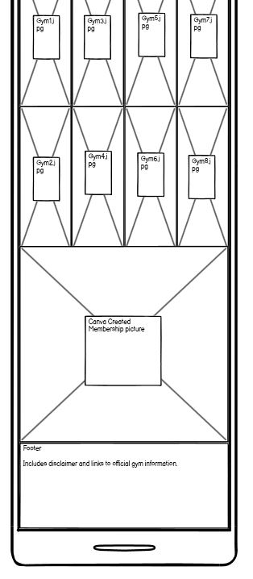

Classes Page layout

The classes page main body will be broken into 4 sections. One for each class. Within each section will be a header for the class in question, a description of the class and a HTML table 
of days and times. Each section will look the same and will be under each other on a mobile device and inline on a webpage.

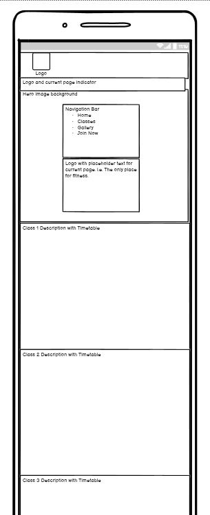

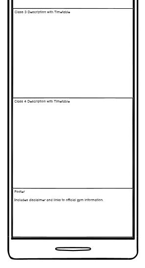

Gallery Page Layout 

The gallery page will include 4 images of the gym facilities. It is designed to show case the gym facilities themselves.

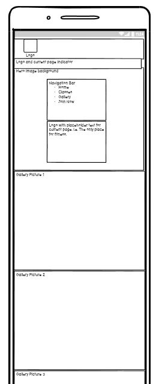

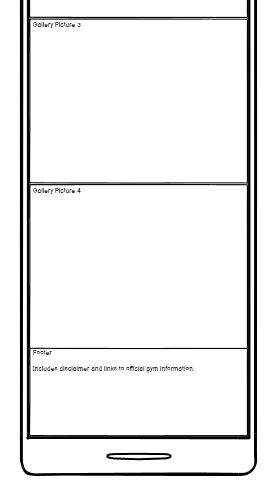

Join Us Page Layout

The Join us page will include a section that includes an image of google maps allowing the user to see where the gym is located. It also includes a link to the 
google maps page the screenshot came from to allow the user to navigate from wherever they are based. Below this will be a section that includes all the membership options
and prices. Another floating text box below this will show a join us form with information required to join.

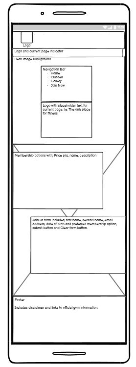

### Desktop Wireframe

General Layout

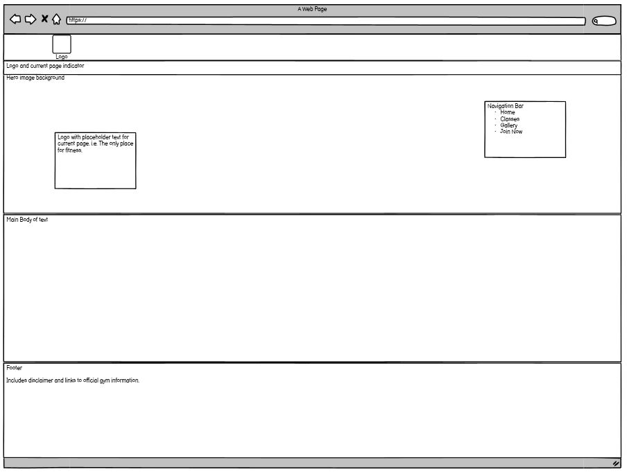

Home Page layout

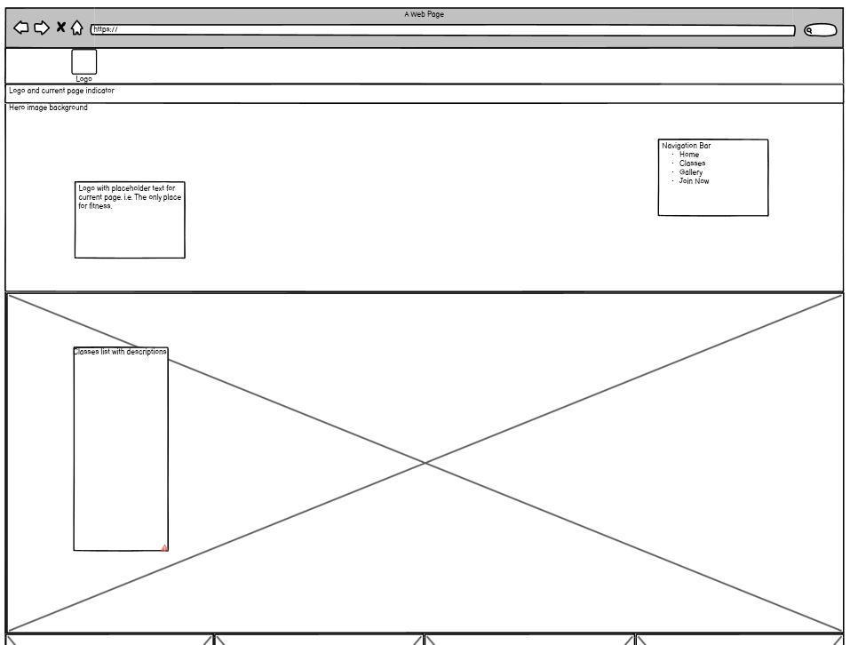

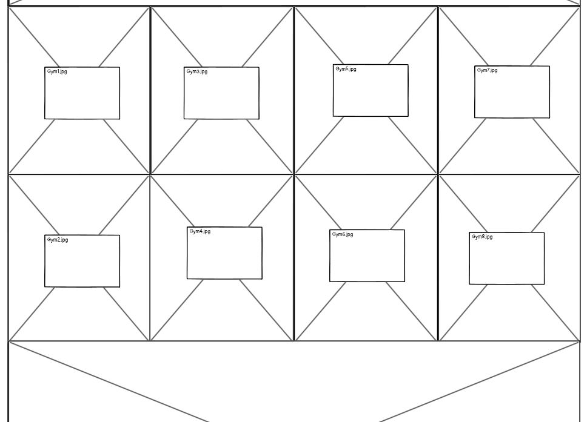

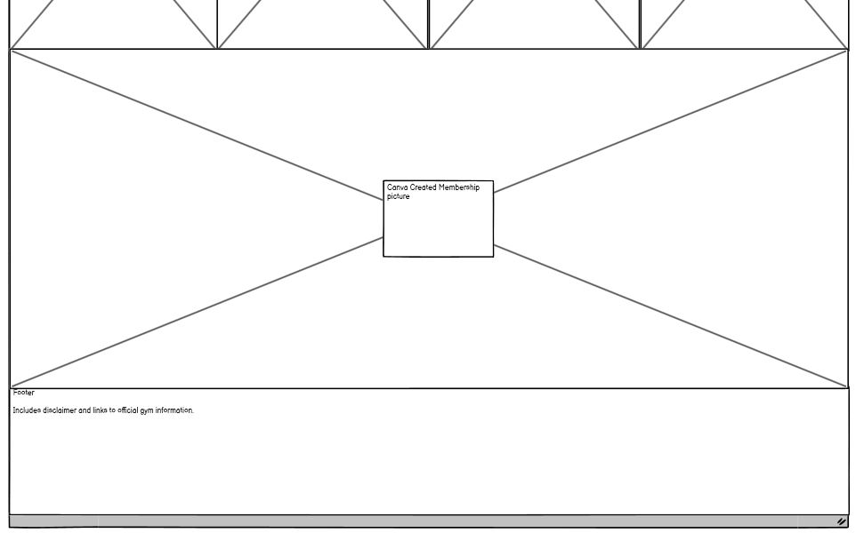

Classes Page layout

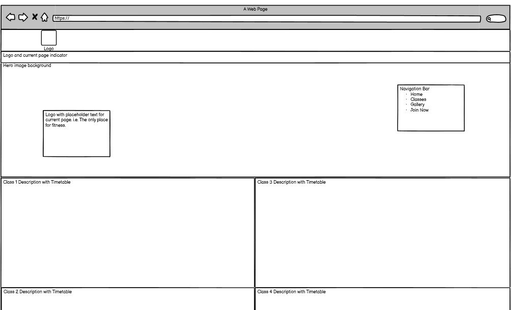

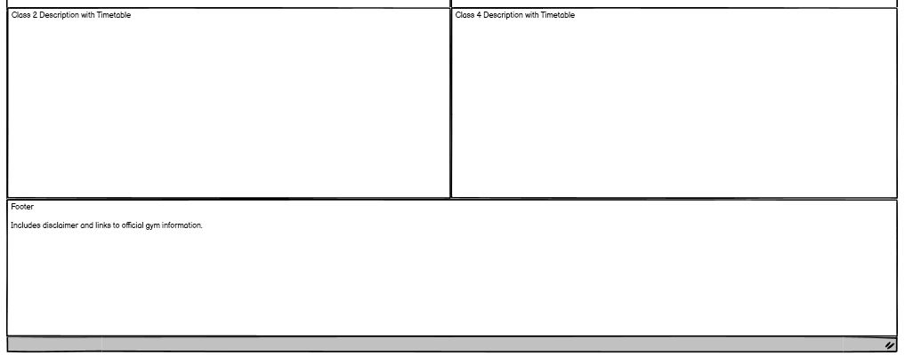

Gallery Page Layout 

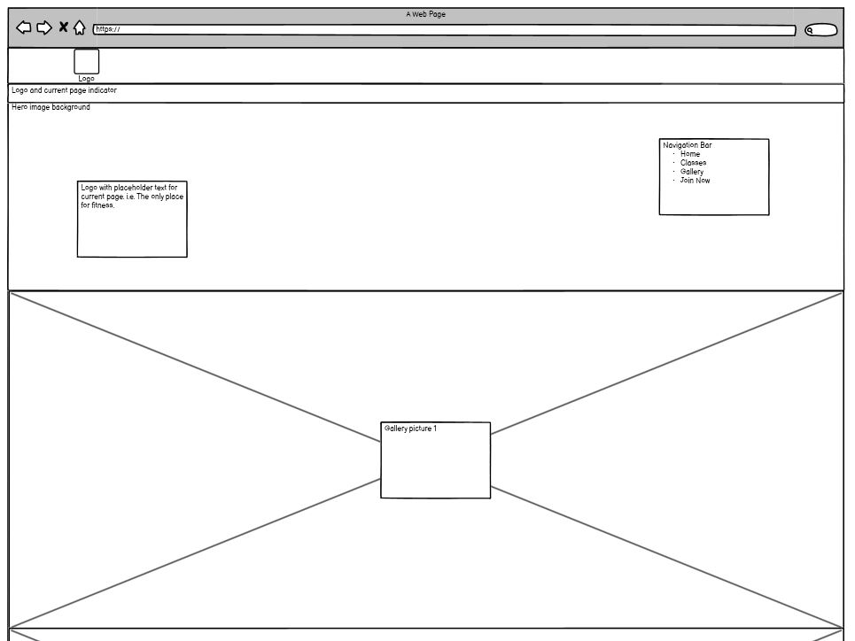

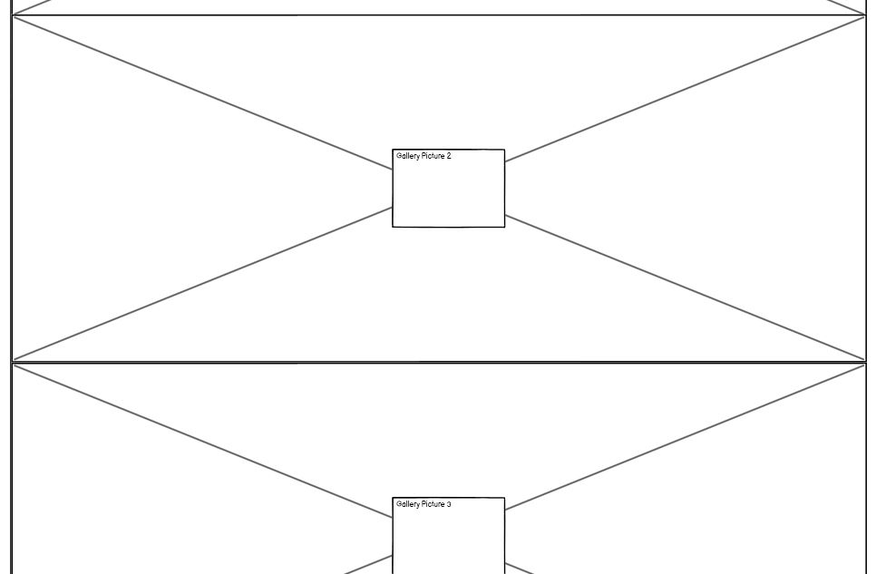

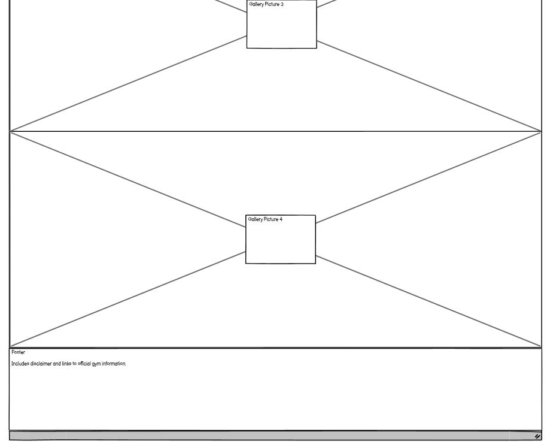

Join Us Page Layout

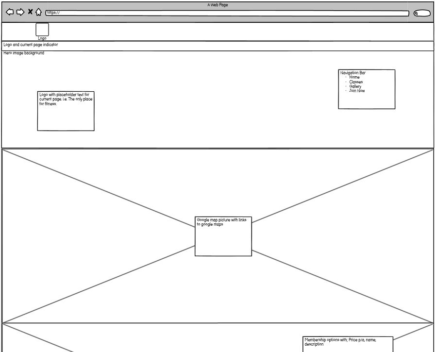

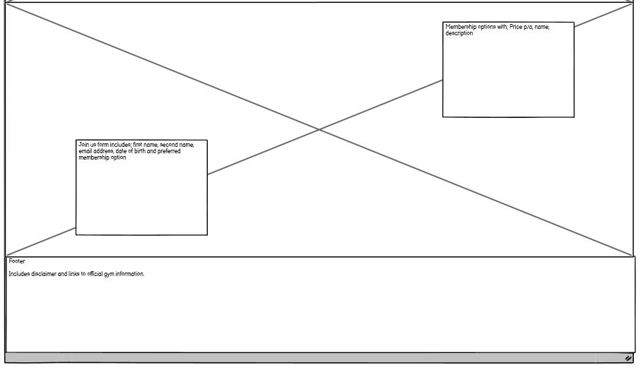

## 2.3 Website Objectives:
* Increase the profile of the gym
* Entice new members to the website
* Provide users with more information on the gym and its facilities
* Encourage users to join the gym
* Help users find the gym

## 2.4 Design Inspiration
My main Inspiration for the website design can be credited to "https://www.fitnessfirst.co.uk/". I have tried to take the themes that I liked and apply them to my website. I particularly like the linear structrue of the site. With the key points displayed in clear, defined sections. The colour scheme was created through a combination of the existing branding as well as the branding I have seen attending my local gym.
I used an online website to get the colour code using the logo as a reference point.

# 3. Features
The website will be made up of a number of pages:

index.html - I.e. the home page. This landing page will be made of up of a number of naviagation options, made up of sections and will be used to promote the other pages

classes.html - A breakdown of all the available classes at the gym. 

gallery.html - The gallery page will provide a pictures of the gym facilities. 

join.html - The join page will give the user a map to the gym with a google maps link and a number of membership options to select from and a join form that they can fill out and submit to join. 

## 3.1 Existing Features
Feature 1 - Join us form. The form will allow the user to select the membership they would like and submit for approval.

## 3.2 Features Left to Implement
Testing flagged that there is slight overlap of elements on the join page below 375px. 

## 3.3 Technologies Used
HTML 5 - https://html.com/html5/

CSS3 - https://en.wikipedia.org/wiki/CSS

Bootstrap v5 (used as reference) - https://getbootstrap.com/docs/5.0/getting-started/introduction/

Balsamiq Wireframes - https://balsamiq.com/wireframes/

# 4. Testing
## 4.1 Informal Development Testing
Informal testing is and was conducted throughout the build. 

My method of testing is based on trial and error, something that I learnt through my time with VBA for MSOffice. I would write a line of code and check the outcome. Mostly working step by step.

The informal process of testing is as follows:
* Before code is written a new preview is opened
* Line/lines of code written
* Preview is opened and refreshed
* Desired outcome is checked
* Outcome is checked in a mobile phone layout using Chrome developer tools.
* If outcome is successful then wider checks on other code are conducted. For example, what impact does it have on other elements.
* If outcome is unsuccessful then the line/lines of code written will be checked and informal testing repeated.

Further testing including sending the website link to my partner who navigated the website on both her phone and tablet. This was useful as it flagged an
issue where pictures were not appearing on the home page.

## 4.2 Formal Deployment Testing
### 4.2.1 External website testing

In order to ensure that my code is correct i used the following website to flag issues with my code.

https://validator.w3.org/ - HTML validator. Looks specifically for errors in my HTML code.

https://jigsaw.w3.org/css-validator/ - CSS validator. Looks specifically for errors in my CSS code.

### 4.2.1.1 Testing Results

HTML Validator 1st round results

Errors per page:

* Index - 3 errors
    - 1. Attribute no-repeat not allowed on element img at this point. 2. Attribute center not allowed on element img at this point. 3. Bad value ./assets/images/Membership Options.png for attribute src on element img: Illegal character in path segment: space is not allowed.

* Index - Error Notes:
    - Error 3 changed file name of membership options.

* Classes - 0 errors
    - Document checking completed. No errors or warnings to show.
* Gallery - 8 errors 1 warning. 
    - 1. Attribute no-repeat not allowed on element img at this point. 2. Attribute center not allowed on element img at this point. 3. Attribute no-repeat not allowed on element img at this point. 4. Attribute center not allowed on element img at this point. 5. Attribute no-repeat not allowed on element img at this point.  6. Attribute center not allowed on element img at this point. 7. Attribute no-repeat not allowed on element img at this point. 8. Attribute center not allowed on element img at this point. 9. Section lacks heading. Consider using h2-h6 elements to add identifying headings to all sections. 

* Gallery - Error Notes:
    - Error 9 (warning) ignored as a heading isnt needed in this example.

* Join - 16 errors 3 warnings
    - 1. Bad value 600px for attribute width on element iframe: Expected a digit but saw p instead. 2. Element option without attribute label must not be empty. 3. Bad value name for attribute type on element input. 4.  Attribute placeholder is only allowed when the input type is email, number, password, search, tel, text, or url. 5. Attribute required is only allowed when the input type is checkbox, date, datetime-local, email, file, month, number, password, radio, search, tel, text, time, url, or week. 6. Duplicate ID form_boxes. 7. The first occurrence of ID form_boxes was here. 8. Bad value name for attribute type on element input. 9. Attribute placeholder is only allowed when the input type is email, number, password, search, tel, text, or url. 10. Attribute required is only allowed when the input type is checkbox, date, datetime-local, email, file, month, number, password, radio, search, tel, text, time, url, or week. 11. Duplicate ID form_boxes. 12. The first occurrence of ID form_boxes was here. 13. Duplicate ID form_boxes. 14.The first occurrence of ID form_boxes was here. 15. Element a not allowed as child of element ul in this context. (Suppressing further errors from this subtree.) 16. Element a not allowed as child of element ul in this context. (Suppressing further errors from this subtree.) 17. Element a not allowed as child of element ul in this context. (Suppressing further errors from this subtree.) 18. Element a not allowed as child of element ul in this context. (Suppressing further errors from this subtree.) 19.  The value of the for attribute of the label element must be the ID of a non-hidden form control. 

* Join - Error notes:
    - Error 1 removed height and width. These are covered with custom css
    - Error 2 updated to have a space instead of nothing. Need to check in round 2 of testing.
    - Error 6 id="form_boxes" updated to be class instead
    - Error 3 changed from name to text
    - Error 16 through 18 tidied the format. Need to check in round 2 of testing.

CSS Validator 1st round results

Initially uploaded as a text file that showed no errors so used the page method as well. Need to understand why it showed no errors.

Errors in code:

* CSS - 3 errors found
    - 1. Unknown error java.lang.Exception: https://antony-thornton.github.io/MS1---Gym-Website/bootstrap.min.css: Not Found. 2. .table_format Too many values or values are not recognized : collapse white. 3. .contact_us Value Error : float center is not a float value : center. 
* CSS - Error notes
    - Error 1 Bootstrap link removed from HTML pages
    - Error 2 removed css line
    - Error 3 removed css line

HTML Validator 2nd round results

* Index - 0 Errors found. Document checking completed. No errors or warnings to show.
* Classes - 0 Errors found. Document checking completed. No errors or warnings to show.
* Gallery - 1 warning found. See round 1 notes.
* Join - 8 errors found
    - 1. Bad value   for attribute selected on element option. 2. Element option without attribute label must not be empty. 3. Element a not allowed as child of element ul in this context. (Suppressing further errors from this subtree.) 4. Element a not allowed as child of element ul in this context. (Suppressing further errors from this subtree.) 5. Element a not allowed as child of element ul in this context. (Suppressing further errors from this subtree.) 6. Element a not allowed as child of element ul in this context. (Suppressing further errors from this subtree.) 7.  Stray end tag a. 8. The value of the for attribute of the label element must be the ID of a non-hidden form control. 

* Join - Error notes:
    - Error 1 and 2. Added <option disabled selected value> -- select an option -- </option> courtesy of https://stackoverflow.com/questions/8605516/default-select-option-as-blank
    - Error 8 changed "select class="custom_select" required=""" to "select id="custom_select" required=""". Check in round 3.
    - Error 3 through 6 looks to be a copy and paste duplication. Check in round 3.

CSS Validator 2nd round results
* CSS - 0 errors found on home page. 0 errors found on classes page. 0 errors found on gallery page. 0 errors found on join page. 

HTML Validator 3rd round results

* Index - 0 Errors found. Document checking completed. No errors or warnings to show.
* Classes - 0 Errors found. Document checking completed. No errors or warnings to show.
* Gallery - 1 warning found. See round 1 notes.
* Join - 0 errors found

CSS Validator 3rd round results
* CSS - 0 errors found on home page. 0 errors found on classes page. 0 errors found on gallery page. 0 errors found on join page. 

Added a video. Retest required.

HTML Validator 4th round results

* Index - 0 Errors found. Document checking completed. No errors or warnings to show.
* Classes - 0 Errors found. Document checking completed. No errors or warnings to show.
* Gallery - 1 warning found. See round 1 notes. 1 error found.
    - 1. The frameborder attribute on the iframe element is obsolete. Use CSS instead.
* Join - 0 errors found

* Gallery - Error Notes:
    - Removed the frameborder element.

CSS Validator 4th round results
* CSS - 0 errors found on home page. 0 errors found on classes page. 0 errors found on gallery page. 0 errors found on join page. 

HTML Validator 5th round results

* Index - 0 Errors found. Document checking completed. No errors or warnings to show.
* Classes - 0 Errors found. Document checking completed. No errors or warnings to show.
* Gallery - 1 warning found. See round 1 notes. 1 error found.
* Join - 0 errors found

CSS Validator 5th round results
* CSS - 0 errors found on home page. 0 errors found on classes page. 0 errors found on gallery page. 0 errors found on join page. 

### 4.2.2 Functionality Testing

### Home Page

* Links - The links should all navigate correctly to the expected web pages.
    - No issues found at time of writing

* Pictures - The pictures should load and not be blurry or stretched.
    - Issue with pictures on home page.

* Sizing - Using google developer the webpage should dynamically stretch using the slider.
    - Home page sizing ok. Need to retest once pictures issue is corrected
    - Classes page - Correctly displays in line under 1200px and in a grid over.
    - Gallery - Pictures and video correctly adjusts to screen sizes
    - Join - Elements scale correctly from 375px upwards. Slight overlap of elements below this.

* Text - The text should be clearly visible on each of the pages.
    - No issues found at time of writing

* Social Media Links - The links should correctly navigate to the official pages.
    - Facebook link directs to non existent page. Replaced with https://www.facebook.com/FitnessFirstUKOfficial/ 
    - Other links redirect correctly at time of writing
* Video - The video should not auto play and scale correctly.
    - No issues found at time of writing

### 4.2.3 Device Testing

The website was tested on the following devices:

* Windows 10 Laptop
* Samsung Galaxy 10+ mobile phone
* IPhone 12Pro
* IPad Mini (unknown model)

### 4.2.4 Spelling

I have included a specific section for spelling. My dyslexia can make this part particularly troublesome. In order to ensure that my spelling is correct I have taken each page and put it into word to spell check. I then manually correct the page in GitPod.

### 4.2.5 User testing and feedback

As part of the testing process i asked a friend and my partner to navigate the website and test the links and provide general feedback.
* Issue flagged with home page pictures not showing. 
* Form only submitting Email and Date of birth

## 4.3 Bugs
List of noticed bugs with notes:
* Issue with divs not displaying in line on the classes page
    - Resolved with media query
* Picture on the home page looked blurry below certain resolution
    - Used media query to remove the picture and show a red background instead
    - Potential to change this so that an image displays but would require the mobile version of the classes list to be adjusted to accomodate
* Embedded Google Maps link was indented to the right cutting off a section of the map
    - Imported styling caused the issue. Removed this to resolve
* Images not loading on the home page after Deployment
    - Issue was due to an additional full stop. The line img src="../assets/images/gym6.1.jpg" alt="Fitness First Gym Picture Classes" should have been img src="../assets/images/gym6.1.jpg" alt="Fitness First Gym Picture Classes"
* Form not submitting all information. Only submitted email and DOB
    - Failed to name the other form list items. Noted in the html file
* Highlighted text in the navigation bar not lining up correctly
    - Issue was due to unnecessary padding. Padding removed.
* Overlapping elements on the join page below 370px
    - Future development point. Unlikely to impact many users if any.
* Underline appeared between the social media links
    - Added text decoration to remove.
* Facebook page didn't load on testing
    - Website link was out of date as page was deleted. No link added.
* Text color in user form matched the background so the user couldn't see the text.
    - Added css to change text color
* Input boxes had different lengths
    - Added css to ensure that the boxes lined up on the dekstop version. 
    - Could add css for a minimum sized window so they line up but not critical.

# 5. Deployment
The website will be deployed using GitHubs built in pages' manager.

Step 1 - Log in to GitHub page

Step 2 - Navigate to project and click settings

Step 3 - In the bar on the left click pages

Step 4 - Under the source dropdown select main and click save

A link should appear above the source dropdown and look something like this

Your site is ready to be published at https://antony-thornton.github.io/MS1---Gym-Website/

# 6. Credits
## Content
Where needed source material is referenced below but also in the HTML page itself using comments. I have done it this way so that the referenced material can be easy to find within the code.

## Media
The photos used in this site were obtained from ...
https://duckduckgo.com/

https://www.fitnessfirst.co.uk/

https://www.pexels.com/

https://fontawesome.com/

https://www.canva.com/en_gb/ - Self created membership option picture

https://www.codegrepper.com/code-examples/css/style+youtube+embed+video+css - For the CSS video style

## Acknowledgements
This project was inspired by Code Institute as part of my First Milestone Project (MS1). 

Thank you to:
https://www.gitpod.io/blog/gitpodify/ 
for references to using gitpod. Specifically opening a preview.

https://bulldogjob.com/news/449-how-to-write-a-good-readme-for-your-github-project 
for help with this ReadMe.

Thank you especially to my mentor Marcel for the time and effort provided. Including during his weekend.

Thank you to Danielle and Alastair for looking through my website and helping with the testing phase.

Where possible acknowledgements will be noted in the code.

# 7. Lessons learnt
## 7.1 Lessons
Understanding and implementing HTML/CSS has been easier than I thought it would be. Creating a basic website has been ok but implementing it has been challenging in places.

More practice projects and pushing the boundaries will help massively. Gaining experience will help. 

Need to plan the layout and content first. Not necessarily the "design" but what I actually want to do at a high level. See https://creately.com/blog/diagrams/website-planning-guide/

Need to push changes more frequently and appropriately. I.e when i make a small change to something like the height of an existing element.

Had an issue with pictures not displaying on the home page. It could have been one of two issues; I added 2 full stops in the file path instead of 1 "img src="../assets/images/gym6.1.jpg" alt="Fitness First Gym Picture Classes"", the file picture size was too big or a combination of the two.

Embedding existing code (i.e. youtube/google maps) is easy to do and should be considered going forward.

Padding was causing an issue with displaying DIV's inline. 

Having a clear structure for the CSS file upfront will help with navigation.

Having a good README up front is extremely useful.

As with work VBA building a database of frequently used code and structures will be good for new projects.

## 7.2 Future study points
Need to revisit the media screen size lesson. I understand the concept but not the application.

README written by Antony Thornton, 2021
